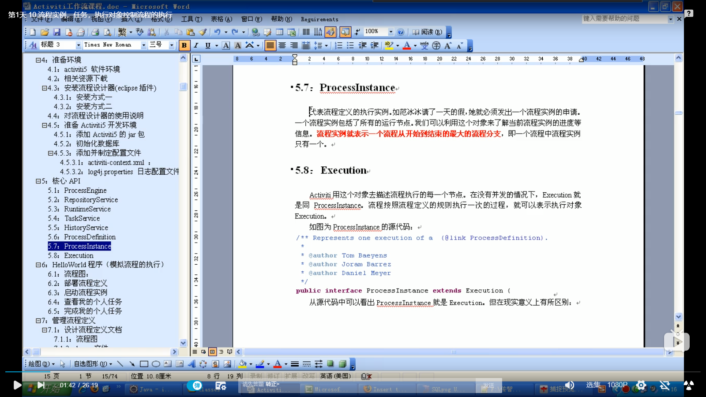

        一：定义工作流
                使用插件完成
                LeaveProcess.bpmn（给计算机进行流程的执行和信息的传递使用的）
                LeaveProcess.png（给用户看的）
        二：执行管理流程工作流
                调用Activiti的API
                activiti.cfg.xml和log4j.properties文件
        *流程引擎ProcessEngine对象（所有的操作都离不开引擎对象
             ProcessEngine defaultProcessEngine = ProcessEngines.getDefaultProcessEngine();）
        *由流程引擎创建各个Service，这些Service是调用工作流23张表服务
            3）可以产生RepositoryService
                 RepositoryService repositoryService = processEngine.getRepositoryService();
             4) 可以产生RuntimeService
        RuntimeService runtimeService = processEngine.getRuntimeService();
            5)可以产生TaskService
        TaskService taskService = processEngine.getTaskService();

        数据库：
        activiti用来存放流程数据一共使用了23张表都是ACT_
        底层操作默认使用mybatis操作
        总结：工作流Activiti的表使用用来存放流程数据的二业务的数据都需要用户自己创建和维护，
        一定需要业务去关联流程，才能开发工作流系统。

流程定义是不能修改的
控制修改（使用流程定义的key相同的情况下，版本升级，以前的流程走完就不会用了，会用最新的版本）

存在2个流程
    流程1：key=helloworld
         version：1
         version：2
    流程2：key=leaveProcess
        version：1
        version：2
        version：3

#总结：
    Deployment部署对象
    1.一次部署的多个文件的信息，对于不需要的流程可以删除和修改。
    2.对应的表：
    act_re_deployment:部署对象表
    act_re_procdef:流程定义表
    act_ge_bytearray:资源文件表
    act_ge_property：主键生成策略表
    ProcessDefinition流程定义
    1.解析.bpmn后得到的流程定义规则的信息，工作流系统就是按照流程定义的规则执行的
    
    SELECT * FROM act_re_procdef #流程定义表
    SELECT * FROM act_ge_bytearray #资源文件表
    SELECT * FROM act_ge_property #主键生成策略表
#流程实例，执行对象，任务

    SELECT * FROM act_ru_execution #正在执行的执行对象表
    SELECT * FROM act_hi_procinst #流程实例的历史表
    SELECT * FROM act_ru_task #正在执行的任务表（只有节点是UserTask的时候，该表中存在数据）
    SELECT * FROM act_hi_taskinst #任务历史表（只有节点是UserTask的时候，该表中存在数据）
    SELECT * FROM act_hi_actinst #所有活动节点的历史表

#说明：
1）因为是任务查询，所以从processEngine中得到TaskService
2）使用TaskService获取到任务查询对象TaskQuery
3）为查询对象添加过滤条件，使用taskAssignee指定任务的办理者（即查询指定用户
的代办任务），同时可以添加分页排序等过滤条件
4）调用list方法执行查询，返回办理者为指定用户的任务列表
5）任务ID、名称、办理人、创建时间可以从act_ru_task表中得到
6）Execution与ProcessInstance见5.6和5.7章节的介绍。在这种情况下，ProcessInstance相当于Execution
流程实例就是表示一个流程从开始到结束的最大的流程分支。
Exceution：Activiti用这个对象去描述流程执行的每一个节点。在没有并发的情况下，Exceution就是ProcessInstance。
流程按照流程定义的规则执行一次的过程，就可以表示执行对象Exceution
public interface ProcessInstance extends Exceution
   流程实例（ProcessInstance）只有一个，但是若内部有分支，并发等，执行对象可以有多个（Execution），
   
   7）如果assignee属性为部门经理，结果为空，因为现在流程只到了“填写请假申请”阶段，
   后面的任务还没有执行，即在数据库中没有部门经理可以办理的任务，所以查询不到。
   8）一个Task节点和Execution节点是1对1的情况，在task对象中使用Execution_来表示他们之间的关系
   9）任务ID在数据库act_ru_task中对应“ID_”列
   
   
   #流程变量
   说明：
   1）流程变量的作用域就是流程实例，所以只要设置就行了，不管在哪个阶段设置
   2）基本类型设置流程变量，在taskService中使用任务ID，定义流程变量的名称，设置流程变量的值。
   3）Javabean类型设置流程变量，需要这个javabean实现了Serilizable接口
   4)设置流程变量的时候，向act_ru_variable这个表添加数据
   
**总结：**
    由于数据库中保存着历史信息以及正在运行的流程实例信息，在实际项目中对于已经完成任务的查看频率远不及代办和
    可接任务的查看，所以Activiti采用分开管理，把正在运行的交给RuntimeService、TaskService管理，而历史数据交给HistoryService来管理
      这样做的好处在于，加快流程执行的速度，因为正在执行的流程的表中数据不会很大。
 
 ##回顾第一天：
 1 .Activiti工作流，如果一个任务完成后，存在多条连线，应该如何处理？
 *在连线中，使用流程变量
 *当一个任务完成之后，根据这几条连线的条件和设置流程的变量，例如${流程变量的名称==‘流程变量的值’}，{}符号是boolean类型，
 在完成任务的时候，设置流程变量，从而判断走那条连线
 2.Activiti工作流中，排他网关和并行网关都能执行什么功能
 排他网关：分支，通过连线设置流程变量，直到总流程的结束。可以对流程进行分支和聚合，注意：流程实例和执行对象是不一样的。
 3：分配个人任务的三种方式
    *直接给值，在xxxx.bpmn文件中指定
    *流程变量${流程变量的名称}或者#{}       
    *使用类 监听这个类（实现一个接口），指定任务的办理人（setAssgnee（））
 4.个人任务和主任务的查询一样吗？
 *不一样
 *都是用TaskService 完成（TaskService.createTaskQuery）  
 *个人任务（taskAssgnee），组任务（taskCandidateUser）
 *数据库存放，个人任务（类型：参与），组任务（类型，参与，候选）
 *拾取任务（claim），将组任务指定给定个人任务
 
----
   
##网关：
###排他网关说明：
1)一个排他网关对应一个以上的顺序流
2）由排他网关流出的顺序都有个conditionExcepression元素，在内部维护返回boolean类型的决策结果。
3）决策网关只会返回一条结果，当流程执行到排他网关时，流程引擎会自动检索网关出口，
从上到下检索如果发现第一条决策结果为true或者没有设置条件的（默认为成立），则流出。
4）如果没有任何一个出口符合条件，则抛出异常。
5）使用流程变量，设置连线条件，并按照连线的条件执行正常工作流，
如果没有条件符合的条件，则以默认的连线离开。

###并行网关说明：
1）一个流程中流程实例只有1个，执行对象有多个
2）并行网关的功能是基于进入和外出的顺序流的：
    分支：并行后的所有外出顺序流，为每个顺序流都创建一个并发分支。
    汇聚：所有到达并行网关，在此等候的进入分支，直到所有进入顺序流成分支都到达以后，流程就会通过汇聚网关。
3）并行网关的进入和外出都是使用相同节点标识
4）如果同一个并行网关有多个进入和多个外出顺序流，它就同时具有分支流和汇聚功能，
这时，网关会先汇聚所有进入的顺序流，然后再切分成多个并行分支。
5）并行网关不会解析条件，即使顺序流中定义了条件，也会被忽略。   
   
##开始活动节点
###总结：
1）结束节点没有出口
2）其他节点有个或多个出口
如果有一个出口，则代表是一个单线流程；
如果有多个出口，则代表是开启并发流程。  
   
   第2天
   

   
   
   
   
   
   
   
   
   
   
   
   
   
   
   
   
   
   
   
   
   
   
   
   ----
   
